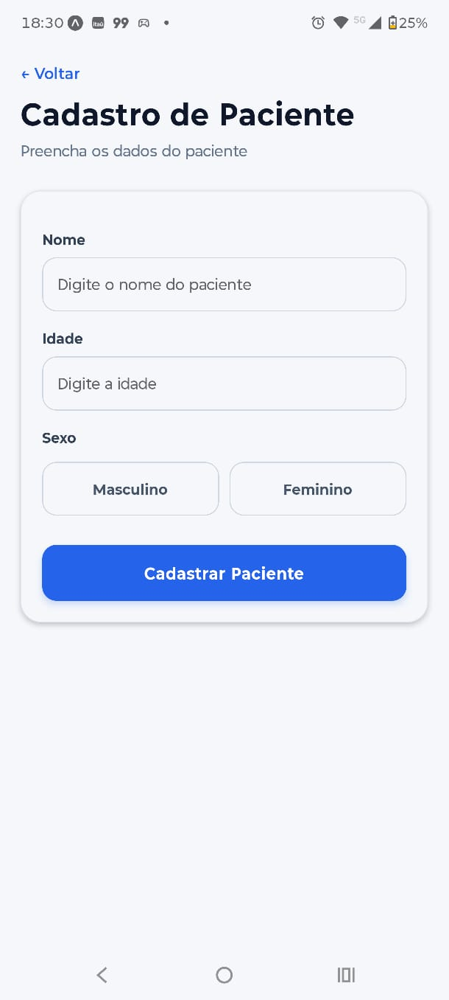
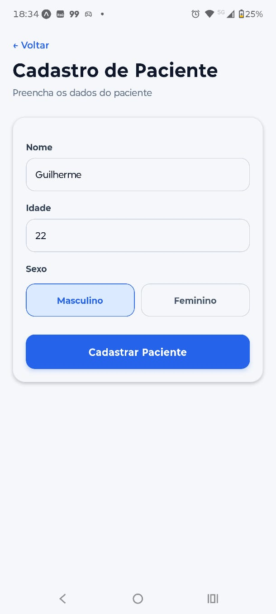
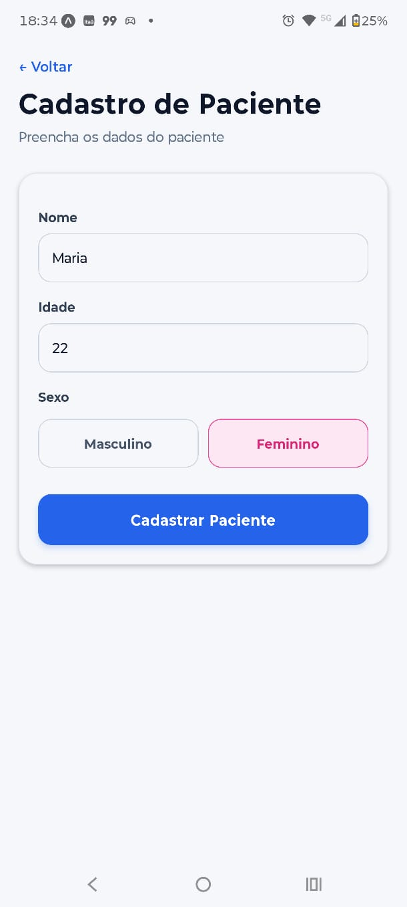
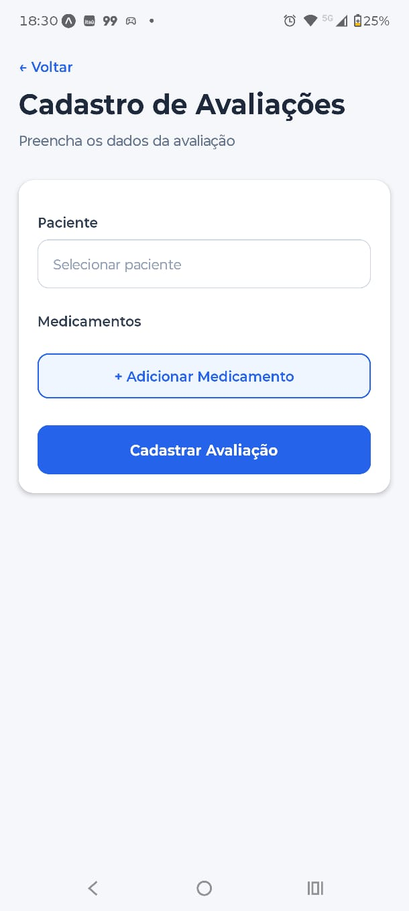
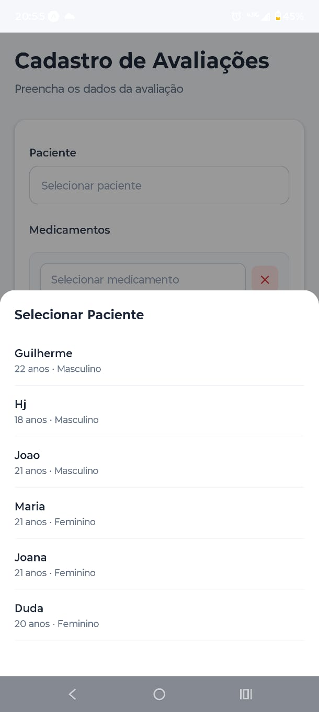
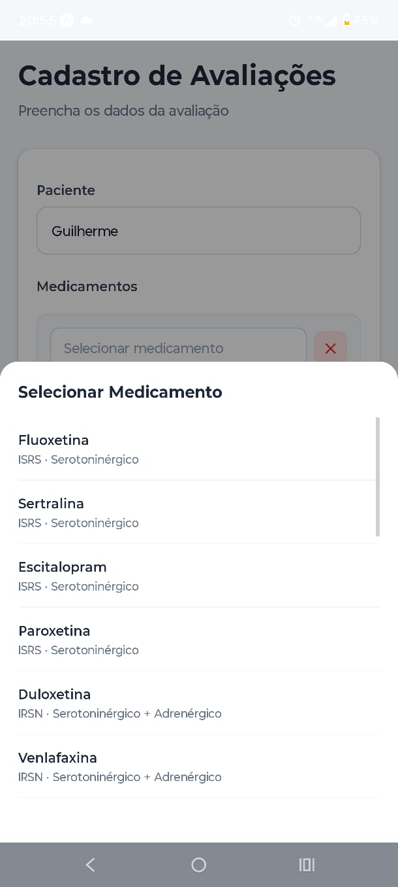
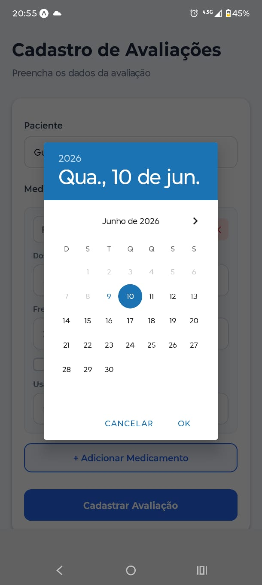
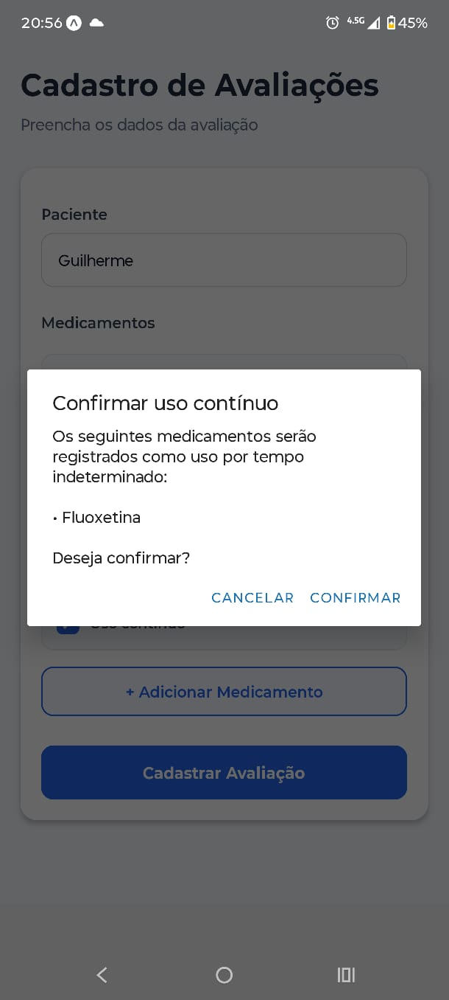
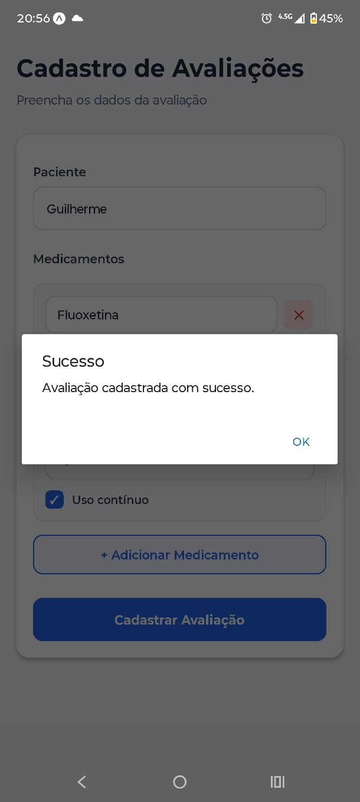
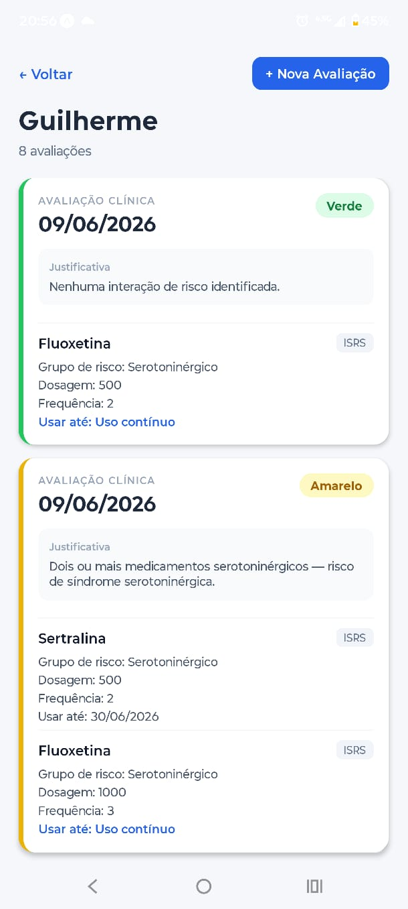

# Triagem de Fármacos

Aplicativo mobile para **triagem e avaliação de risco de interações medicamentosas** em pacientes. A partir dos medicamentos cadastrados em cada avaliação, o app classifica o paciente em um nível de risco (🟢 Verde, 🟡 Amarelo ou 🔴 Vermelho), auxiliando o profissional de saúde na identificação de combinações potencialmente perigosas (como síndrome serotoninérgica, depressão do SNC e dependência).

Projeto desenvolvido para a **Universidade do Vale do Sapucaí (UNIVAS)**.

## Integrantes da equipe

- Eduardo Abrão
- Gabriel Rufino
- Guilherme Henrique
- Jean Souza

## Descrição do aplicativo

O **Triagem de Fármacos** é um app construído em React Native (Expo) que permite:

- **Autenticação** de usuários (tela de login).
- **Cadastro de pacientes**, com dados pessoais e sexo.
- **Listagem de pacientes**, com badge do último risco avaliado e filtro por nível de risco.
- **Criação de avaliações**, associando medicamentos a um paciente, com seleção de data, marcação de uso contínuo e leitura por câmera.
- **Classificação automática de risco** das avaliações com base nos grupos de risco dos medicamentos (serotoninérgico, sedativo, adrenérgico e dependência).
- **Histórico de avaliações** por paciente.

Os dados são persistidos localmente no dispositivo usando **SQLite** (`expo-sqlite`).

### Tecnologias principais

- [React Native](https://reactnative.dev/) `0.81` + [React](https://react.dev/) `19`
- [Expo](https://expo.dev/) `54`
- [TypeScript](https://www.typescriptlang.org/)
- [React Navigation](https://reactnavigation.org/) (native stack)
- [expo-sqlite](https://docs.expo.dev/versions/latest/sdk/sqlite/) — banco de dados local
- [expo-camera](https://docs.expo.dev/versions/latest/sdk/camera/) e [expo-notifications](https://docs.expo.dev/versions/latest/sdk/notifications/)

## Como rodar o projeto

### Pré-requisitos

- [Node.js](https://nodejs.org/) (versão LTS recomendada) e npm
- [Expo CLI](https://docs.expo.dev/more/expo-cli/) (executado via `npx`, não precisa instalar globalmente)
- Para rodar no celular: aplicativo **Expo Go** (Android/iOS) — ou um emulador Android / simulador iOS configurado

### Instalação

```bash
# 1. Clone o repositório
git clone https://github.com/UmbrellaCorpBr/triagem-farmacos-front.git
cd triagem-farmacos-front

# 2. Instale as dependências
npm install
```

### Executando

```bash
# Inicia o servidor de desenvolvimento do Expo
npm start
```

Em seguida, leia o QR Code com o app **Expo Go** ou escolha uma das plataformas:

```bash
npm run android   # abre no emulador/dispositivo Android
npm run ios       # abre no simulador iOS (macOS)
npm run web       # abre no navegador
```

## Prints das telas implementadas

### Login

| Tela de Login | Login preenchido |
|:---:|:---:|
|  |  |

### Página inicial


### Pacientes

| Lista de pacientes | Cadastro de paciente |
|:---:|:---:|
|  |  |

| Cadastro (Masculino) | Cadastro (Feminino) |
|:---:|:---:|
|  |  |

### Avaliações e medicamentos

| Formulário de avaliação | Selecionar paciente |
|:---:|:---:|
|  |  |

| Selecionar medicamento | Calendário do medicamento |
|:---:|:---:|
|  |  |

| Confirmar uso contínuo | Medicamento cadastrado |
|:---:|:---:|
|  |  |

### Histórico de avaliações do paciente


